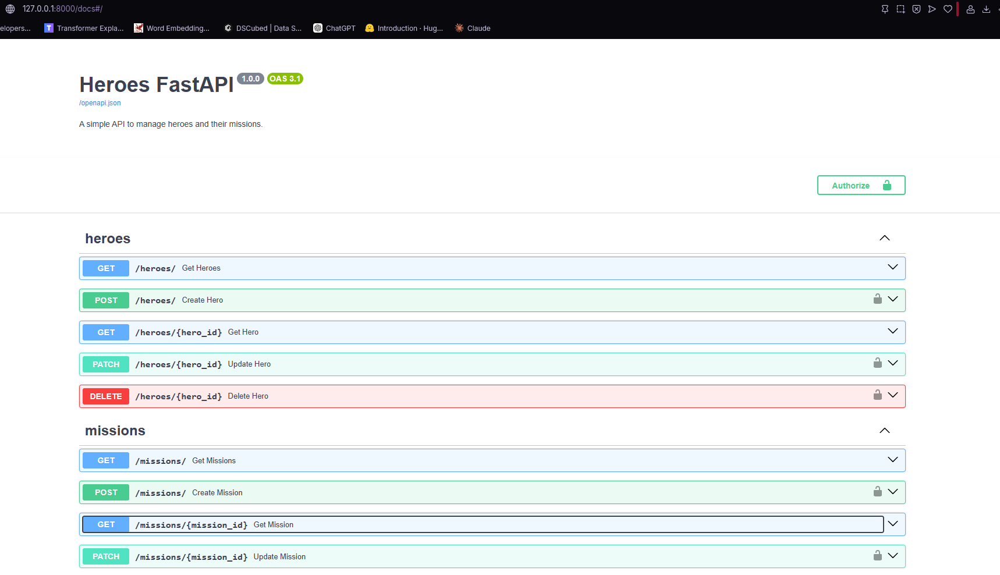
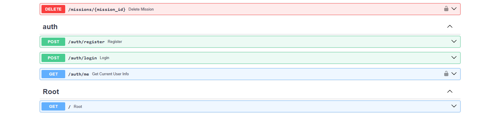
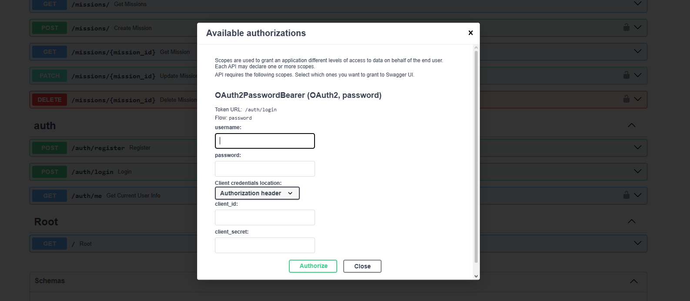
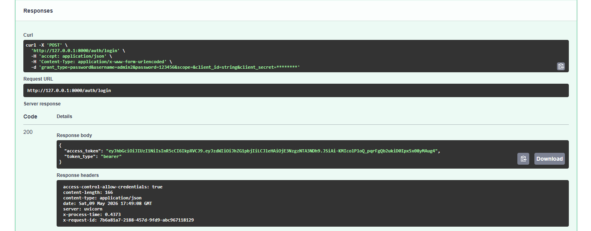
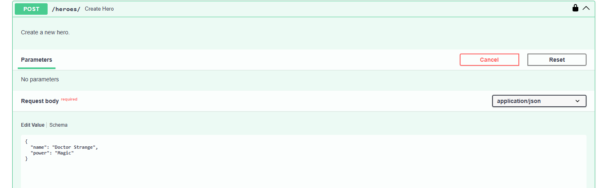
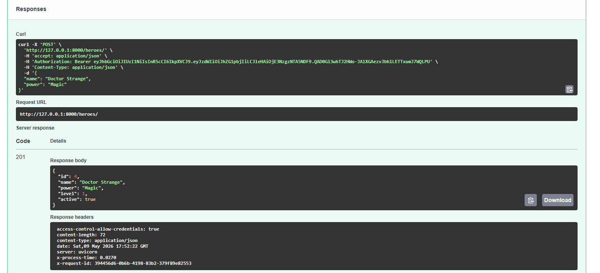
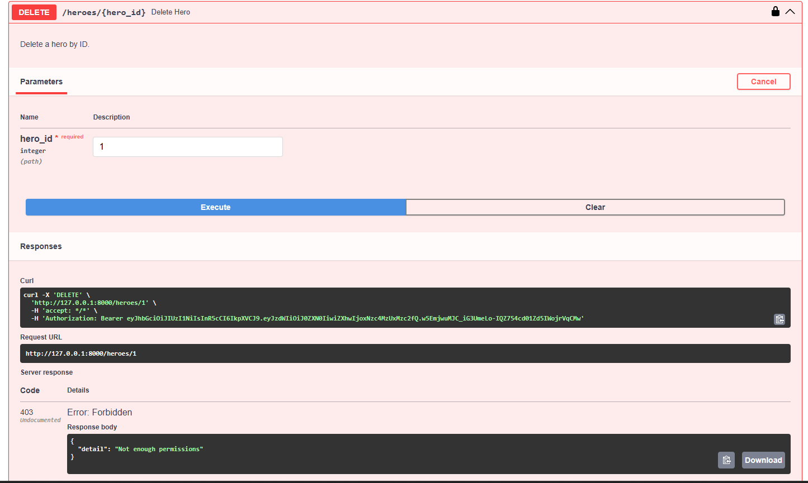
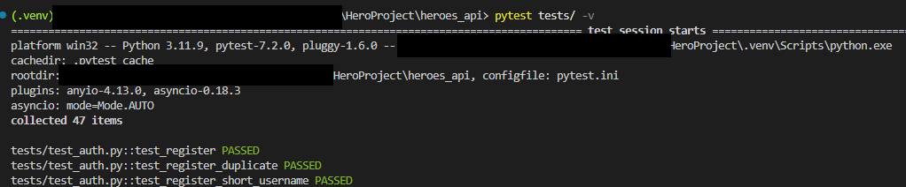
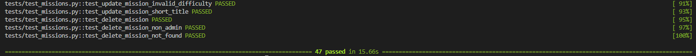

# Heroes API

## Setup & Run
1. Clone the repo
2. Create a virtual environment and install dependencies:
   ```bash
   pip install -r requirements.txt
   ```
3. Navigate to the project folder:
   ```bash
   cd heroes_api
   ```
4. Start the server:

   **Option A — uvicorn** (recommended, works on all platforms):
   ```bash
   uvicorn app.main:app --reload
   ```

   **Option B — fastapi dev** (requires setting PYTHONPATH first):
   ```bash
   # PowerShell
   $env:PYTHONPATH = "."; fastapi dev app/main.py

   # Mac/Linux
   PYTHONPATH=. fastapi dev app/main.py
   ```

5. Open the interactive API docs at: http://127.0.0.1:8000/docs

## Run Tests
- pytest tests/ -v

## API Overview

### Auth
| Method | Path | Auth | Description |
|--------|------|------|-------------|
| POST | `/auth/register` | Public | Register a new user |
| POST | `/auth/login` | Public | Login and receive JWT access token |
| GET | `/auth/me` | User | Get current authenticated user info |

### Heroes
| Method | Path | Auth | Description |
|--------|------|------|-------------|
| GET | `/heroes/` | Public | List all heroes |
| GET | `/heroes/{id}` | Public | Get hero by ID |
| POST | `/heroes/` | User | Create a new hero |
| PATCH | `/heroes/{id}` | User | Update hero fields (name, power, level, active) |
| DELETE | `/heroes/{id}` | Admin | Delete hero (blocked if hero has active missions) |

### Missions
| Method | Path | Auth | Description |
|--------|------|------|-------------|
| GET | `/missions/` | Public | List all missions |
| GET | `/missions/{id}` | Public | Get mission by ID |
| POST | `/missions/` | User | Create a new mission and assign to a hero |
| PATCH | `/missions/{id}` | User | Update mission fields (title, difficulty, completed, hero) |
| DELETE | `/missions/{id}` | Admin | Delete a mission |

## Future Improvements
1. Paginations - GET endpoints should return a default number instead of fetching everything. In case of huge responses, it would generate issues.
2. Filtering/Searching - query params on GET endpoints (eg. ?active=true, ?difficulty=5)
3. Logging - add logger with log levels, so debugging and production monitoring would be efficient/easier
4. Rate limiting - especially for public endpoints, to prevent abuse

## Screenshots

<!-- 
  HOW TO ADD SCREENSHOTS:
  1. Create a folder named "screenshots" inside heroes_api/
  2. Save your images there (e.g. swagger_ui.png, jwt_auth.png)
  3. Embed them using the syntax below:

  

  Example:
-->

### Swagger UI



### JWT Authorization



### Example Request & Response
#### **200 - Success** 


#### **401 - Unauthorized**
.png)
.png)
#### **403 - Forbidden**


### Tests Passing

